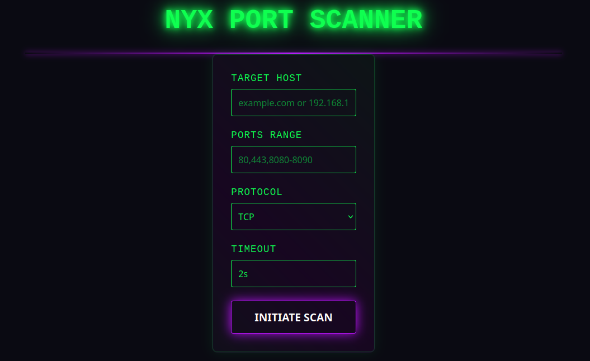
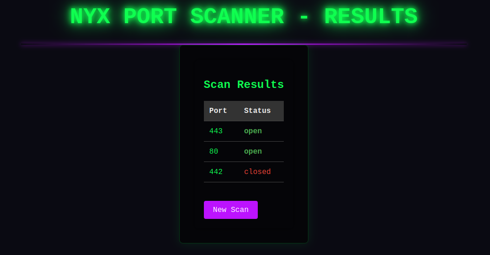

# Nyx - Simple Port Scanner in Go

**Nyx** is a dual-interface port scanning tool written in Go, offering both CLI and web-based scanning capabilities.



## Features

### Core Functionality
- Concurrent port scanning engine
- Support for TCP/UDP protocols (IPv4/IPv6)
- Port range specification (e.g., 80,443,8000-9000)
- Configurable connection timeout

### CLI Interface
- JSON output for programmatic use
- Lightweight executable (<5MB)
- Pipeline-friendly output

### Web Interface
- Browser-based scanning interface
- Responsive design
- Interactive results display
- Form-based configuration


## Installation

### Install from Source
```bash
git clone https://github.com/karmanajs/nyx.git
```

### Using Go Install
```bash
go install github.com/karmanajs/nyx@latest
```

### Build make or task
```bash
cd nyx

# Build both components on make
make all

# Or usage task
task all

# Or build individually
make build-cli    # command-line interface
make build-server # web interface

# Or build individually on task
task build-cli    # command-line interface
task build-server # web interface
```

### Cleanup
```bash
# Usage make
make clean

# Or usage task
task clean
```

## Web Interface Usage

### Configuration Options

#### Scan Configuration
- Target Host: Enter domain name or IP address
- Ports: Specify ports/ranges (comma-separated)
- Protocol: Select TCP/UDP protocol
- Timeout: Set connection timeout (default: 2s)

#### Viewing Results

##### Results include:
- Port number
- Status (open/closed)




## CLI Usage

### Basic syntax:
```bash
nyx-cli -h <host> [-p <ports>] [-tp <protocol>] [-jf <output.json>]
```


### Options

| Flag               | Description                              | Default   |
|--------------------|------------------------------------------|-----------|
| `-h`, `--host`     | Target host (IP or domain)               | *required*|
| `-p`, `--ports`    | Ports to scan (comma-separated or range) | `80,443`  |
| `-tp`, `--type-protocol` | Protocol type (tcp/udp)            | `tcp`     |
| `-jf`, `--json-file`	| Save results to JSON file	            | `- `      |
| `-to`, `--timeout` 	|Connection timeout (e.g. 500ms, 2s)	| `2s`      |

## Supported Protocols
- tcp, tcp4 (IPv4-only), tcp6 (IPv6-only)
- udp, udp4 (IPv4-only), udp6 (IPv6-only)
- ip, ip4 (IPv4-only), ip6 (IPv6-only)
- unix, unixgram, unixpacket

## Examples

Basic scan
```bash
nyx-cli -h example.com -p 22,80,443
```

Scan common ports on example.com:
```bash
nyx -h example.com
```

Scan specific ports with UDP protocol:
```bash
nyx -h example.com -p 53,123 -tp udp
```

Scan a port range and save to JSON:
```bash
nyx -h example.com -p 8000-9000 -jf results.json
```

Scan usage all flags:
```bash
nyx-cli -h 192.168.1.1 -p 1-1024 -tp tcp -to 1s -jf results.json
```

## Output Example
Standard output:
```bash
Starting Nyx 0.0.1
Scanning example.com (tcp)
80 - open
443 - open
8080 - closed
9000 - closed
```
JSON output (when using -jf):
```json
[
  {
    "port": 80,
    "status": "open"
  },
  {
    "port": 443,
    "status": "open"
  },
  {
    "port": 8080,
    "status": "closed"
  }
]
```

## License
This project is licensed under the MIT License - see the [LICENSE](LICENSE) file for details.

Copyright © 2025 github.com/karmanajs